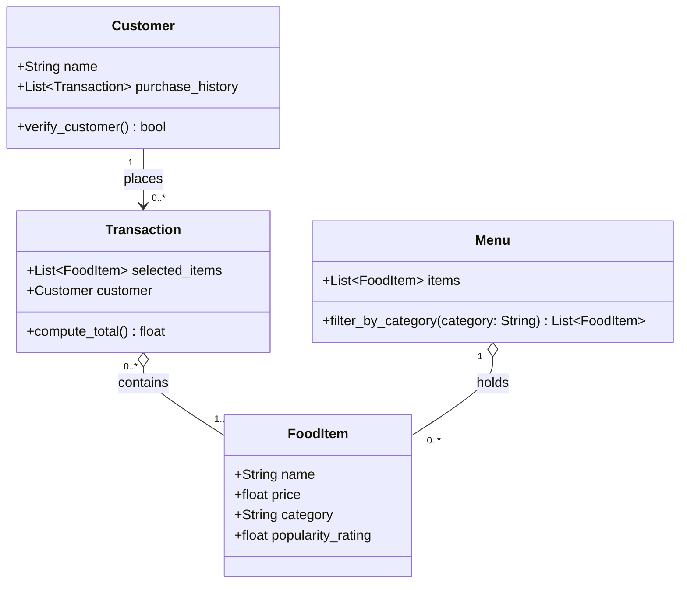

## UML Class Diagram

```mermaid
classDiagram
    class Customer {
        +String name
        +List~Transaction~ purchase_history
        +verify_customer() bool
    }

    class FoodItem {
        +String name
        +float price
        +String category
        +float popularity_rating
    }

    class Menu {
        +List~FoodItem~ items
        +filter_by_category(category: String) List~FoodItem~
    }

    class Transaction {
        +List~FoodItem~ selected_items
        +Customer customer
        +compute_total() float
    }

    Customer "1" --> "0..*" Transaction : places
    Transaction "0..*" o-- "1..*" FoodItem : contains
    Menu "1" o-- "0..*" FoodItem : holds
```