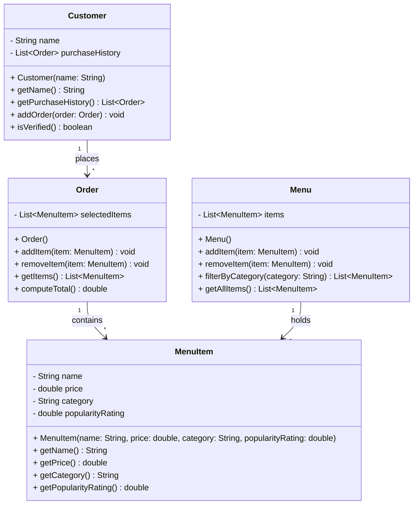

# ByteBites UML Class Diagram — Final Design

Refined using the ByteBites Design Agent with `bytebites_spec.md` as context.

## Class Diagram (Mermaid)

## Class Descriptions

| Class | Purpose |
|-------|---------|
| **Customer** | Represents an app user with a name and purchase history. `isVerified()` returns true if the customer has at least one past order. |
| **MenuItem** | A single food or drink product with name, price, category (e.g., "Drinks", "Desserts"), and popularity rating. |
| **Menu** | The full digital catalog of MenuItems. Supports filtering by category string. |
| **Order** | A single transaction grouping selected MenuItems. `computeTotal()` sums the prices of all selected items. |

## Comparison with Draft

| Aspect | Draft | Final |
|--------|-------|-------|
| Classes | 4 (Customer, MenuItem, Menu, Order) | Same 4 — no extras added |
| Constructors | Not shown | Added for clarity on required initialization parameters |
| `isVerified()` | Vague — noted as a concern | Defined: returns true if purchaseHistory is non-empty |
| MenuItem mutability | Had no setters | Kept immutable — price/category/rating set at construction per spec |
| Relationships | Correct | Unchanged — all match the feature request |

## Verification Against Feature Request

- **"manage our customers, tracking their names and their past purchase history"** — Customer has `name` and `purchaseHistory` fields.
- **"verify they are real users"** — `isVerified()` checks purchase history.
- **"track the name, price, category, and popularity rating for every item"** — MenuItem has all four attributes.
- **"a digital list that holds all items and lets us filter by category"** — Menu holds MenuItems with `filterByCategory()`.
- **"group them into a single transaction... store the selected items and compute the total cost"** — Order has `selectedItems` list and `computeTotal()`.

All requirements are accounted for. No extra classes or attributes beyond the spec.
