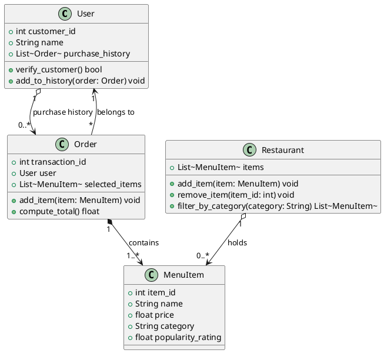

## UML Class Diagram

```plantuml
@startuml

class User {
    +int customer_id
    +String name
    +List~Order~ purchase_history
    +verify_customer() bool
    +add_to_history(order: Order) void
}

class MenuItem {
    +int item_id
    +String name
    +float price
    +String category
    +float popularity_rating
}

class Restaurant {
    +List~MenuItem~ items
    +add_item(item: MenuItem) void
    +remove_item(item_id: int) void
    +filter_by_category(category: String) List~MenuItem~
}

class Order {
    +int transaction_id
    +User user
    +List~MenuItem~ selected_items
    +add_item(item: MenuItem) void
    +compute_total() float
}

User "1" o--> "0..*" Order : purchase history
Order "*" --> "1" User : belongs to
Order "1" *--> "1..*" MenuItem : contains
Restaurant "1" o--> "0..*" MenuItem : holds

@enduml
```