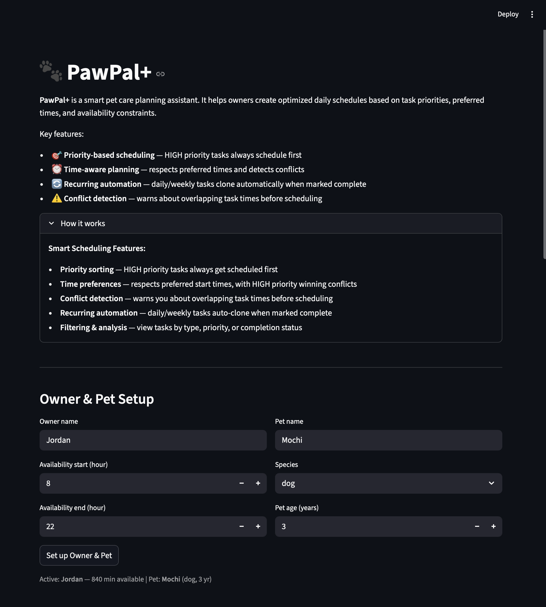
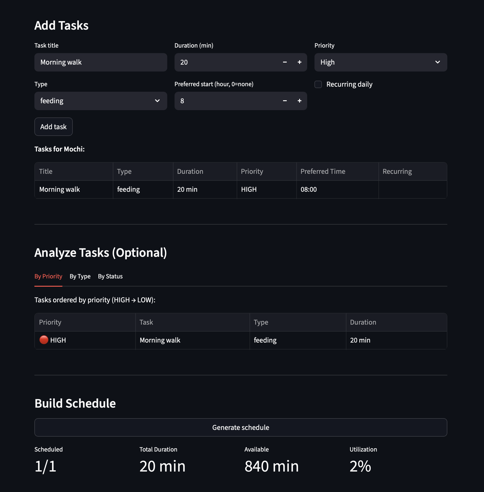
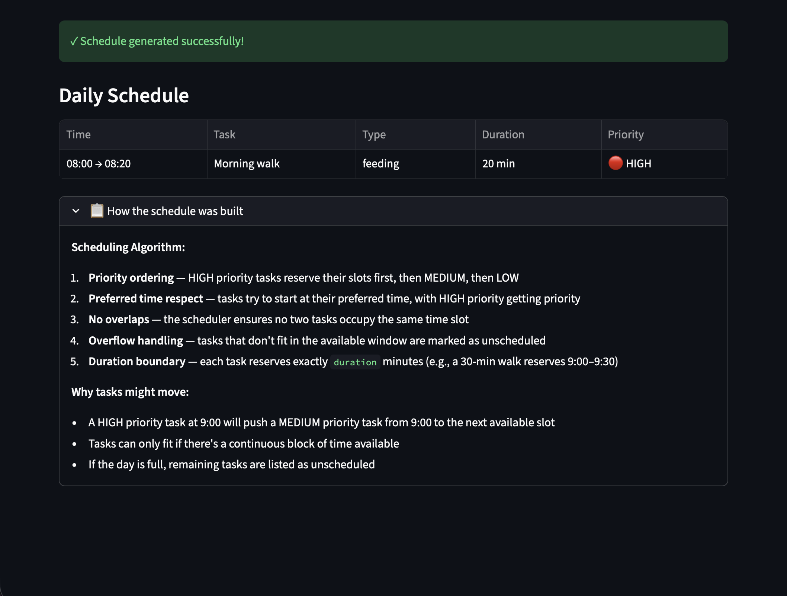

# PawPal+

You are building **PawPal+**, a Streamlit app that helps a pet owner plan care tasks for their pet.

## Scenario

A busy pet owner needs help staying consistent with pet care. They want an assistant that can:

- Track pet care tasks (walks, feeding, meds, enrichment, grooming, etc.)
- Consider constraints (time available, priority, owner preferences)
- Produce a daily plan and explain why it chose that plan

Your job is to design the system first (UML), then implement the logic in Python, then connect it to the Streamlit UI.

## What you will build

Your final app should:

- Let a user enter basic owner + pet info
- Let a user add/edit tasks (duration + priority at minimum)
- Generate a daily schedule/plan based on constraints and priorities
- Display the plan clearly (and ideally explain the reasoning)
- Include tests for the most important scheduling behaviors

## Features

### Scheduling Algorithms

| Feature | What it does | When you use it |
|---------|-------------|-----------------|
| **Priority-based scheduling** | Tasks are scheduled in strict priority order (HIGH → MEDIUM → LOW), ensuring critical tasks like medication always get their preferred time slot first. | Every schedule generation |
| **Greedy interval scheduling** | Uses an O(n²) interval-packing algorithm to fit tasks at the earliest available time, respecting the owner's availability window (e.g., 8 AM – 10 PM). If a task doesn't fit, it's marked unscheduled with a clear reason. | Every schedule generation |
| **Preferred time respect** | Tasks are placed at or after their preferred time if available; only shifted if a higher-priority task claims that slot. | When scheduling tasks with `preferred_time` set |
| **Sorting by preferred time** | Tasks are displayed in chronological order by preferred time, with flexible tasks sorted last. | View task list; analyze schedule |

### Filtering & Analysis

| Feature | What it does |
|---------|-------------|
| **Filter by type** | Display only tasks of one category (FEEDING, WALK, MEDICATION, APPOINTMENT, ENRICHMENT, GROOMING). |
| **Filter by status** | Show only pending or completed tasks. Useful for tracking progress through the day. |
| **Sort by priority** | Reorganize tasks from highest to lowest priority (HIGH → MEDIUM → LOW) with color-coded indicators (🔴🟡🟢). |

### Conflict Detection

| Feature | When it triggers | What it shows |
|---------|-----------------|---------------|
| **Pre-schedule conflict warning** | Before generating the schedule, when two tasks have overlapping `preferred_time` intervals | ⚠️ Warning showing which tasks overlap and their preferred times (e.g., 09:00–09:20 ↔️ 09:05–09:15) |
| **Post-schedule conflict detection** | After scheduling, as a sanity check | ✓ Confirms greedy algorithm guarantees no overlaps within a pet's schedule |
| **Cross-pet conflict detection** | When owner has multiple pets and tasks overlap in the final schedule | ⚠️ Flags tasks where the owner must be in two places at once (e.g., walking Dog while feeding Cat at the same time) |

### Task Management

| Feature | What it does |
|---------|-------------|
| **Recurring task automation** | Marking a recurring task complete automatically clones it with `next_due` date:  +1 day for daily, +7 days for weekly. Owner never needs to re-enter it. |
| **Completion tracking** | Mark tasks as done; recurring tasks spawn next instance. Pending task view shows unfinished work. |
| **Unscheduled task handling** | Tasks that don't fit get a clear, actionable reason:  "outside availability window," "no available slot," etc. Suggestions provided to resolve them. |

### UI & Presentation

| Feature | What it shows |
|---------|--------------|
| **Task analysis dashboard** | Three tabs: By Priority (sorted 🔴→🟡→🟢), By Type (filterable), By Status (pending vs. done) |
| **Schedule metrics** | Total scheduled, duration, available time remaining, and utilization % |
| **Algorithm explanation** | "How the schedule was built" expander explains priority ordering, preferred time handling, and why certain tasks moved |
| **Professional formatting** | HH:MM time display, color emoji priority indicators, expandable sections, responsive tables |

## Smarter Scheduling

The scheduler goes beyond a simple list to give the owner a smarter daily plan:

- **Sorting** — tasks are displayed in preferred-time order regardless of the order they were added, and scheduled by priority (HIGH first) so critical tasks like medication always claim their slot first.
- **Filtering** — tasks can be filtered by `TaskType` (e.g. show only FEEDING tasks) or by completion status (pending vs. done).
- **Recurring task automation** — marking a recurring task complete automatically clones it with a `next_due` date (today + 1 day for daily, + 7 days for weekly), so the owner never has to re-enter it.
- **Conflict detection** — the scheduler warns about two kinds of conflicts before and after scheduling:
  - *Pre-schedule*: tasks whose `preferred_time` intervals overlap, flagging slots that will need to shift.
  - *Post-schedule / cross-pet*: scheduled tasks that end up overlapping, including tasks across different pets that require the owner to be in two places at once.

## 📸 Demo

### Setup: Owner & Pet Details
Enter your name, pet information, and availability window. The app validates all inputs and shows clear error messages.



### Task Management & Conflict Warnings
Add tasks with priority, preferred time, and recurrence settings. The app instantly detects conflicting preferred times and warns you before scheduling. Use the "Analyze Tasks" tabs to filter by priority, type, or completion status.



### Daily Schedule & Metrics
Generate a priority-sorted schedule with metrics dashboard. View scheduled tasks in chronological order with clarity on what was moved and why. The "How the schedule was built" expander explains the algorithm's decisions. Unscheduled tasks receive actionable suggestions.



## Testing PawPal+

### Run the tests

```bash
python -m pytest
```

Run with verbose output to see each test name:

```bash
python -m pytest tests/test_pawpal.py -v
```

### What the tests cover

The suite contains **106 tests** across every class and method in `pawpal_system.py`:

| Area | What is verified |
|---|---|
| **Task validation** | `duration ≤ 0`, `preferred_time` out of range, invalid `recurrence` string all raise `ValueError`; boundary values (0, 1439) are accepted |
| **Task behaviour** | `mark_completed()`, `overlaps_with()` (overlap, adjacent, contained, unscheduled), `clone_for_next_occurrence()` (daily/weekly dates, field preservation, reset state, unique id), `__str__` output |
| **Pet** | `add_task`, `remove_task` by id (including duplicate-title safety), `get_tasks_by_priority` sort order |
| **Owner validation** | `available_start ≥ available_end`, out-of-range values raise `ValueError`; boundary windows (1-minute, midnight start, 11:59 PM end) are accepted |
| **Scheduler — sorting & filtering** | Chronological sort, `None`-preferred-time sorts last, `filter_by_type`, `filter_by_status`, `get_recurring_tasks` |
| **Scheduler — scheduling** | Priority ordering, duration tiebreaker, no-overlap guarantee, overflow to unscheduled, window boundary off-by-one, stale data reset on re-run, empty pet, empty owner |
| **Scheduler — conflict detection** | Pre-schedule pairs, 3-way overlaps, adjacent tasks not flagged, tasks without preferred_time ignored, post-schedule greedy guarantee, cross-pet conflicts |
| **Scheduler — recurrence** | Daily and weekly clones, non-recurring tasks never clone, `is_recurring=True` with empty `recurrence` string does not clone, task found in second pet |
| **Output correctness** | `scheduled_end == start + duration`, no task exceeds `available_end`, unscheduled tasks have `None` times and non-empty reasons, `to_dict_list` key/value accuracy, conflict pairs are 2-tuples of pet-owned tasks |
| **Rare edge cases** | `preferred_time` before `available_start`, exact window fill, one-minute overflow, 3-conflict detection, all-completed pending list, empty inputs on every method |

### Confidence level

★★★★★ (5 / 5)

The core scheduling contract (priority order, no overlaps, overflow handling, recurring automation) is fully exercised with both happy-path and edge-case tests, including boundary conditions and output field correctness. The Streamlit UI layer (`app.py`) is also fully covered with **52 automated tests** that verify form inputs, button interactions, session state management, error/success/warning messages, and complete user workflows (setup → add tasks → generate schedule). Total test coverage: **158 tests** (106 core logic + 52 UI tests), all passing.

## Getting started

### Setup

```bash
python -m venv .venv
source .venv/bin/activate  # Windows: .venv\Scripts\activate
pip install -r requirements.txt
```

### Suggested workflow

1. Read the scenario carefully and identify requirements and edge cases.
2. Draft a UML diagram (classes, attributes, methods, relationships).
3. Convert UML into Python class stubs (no logic yet).
4. Implement scheduling logic in small increments.
5. Add tests to verify key behaviors.
6. Connect your logic to the Streamlit UI in `app.py`.
7. Refine UML so it matches what you actually built.
